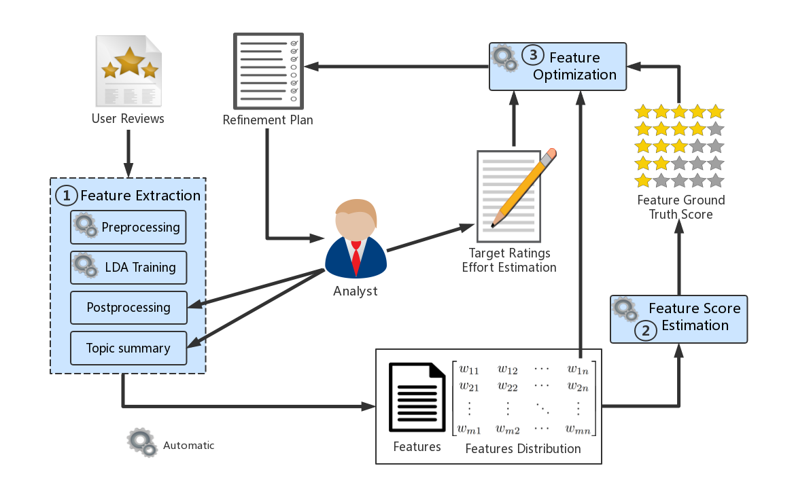

# Software feature refinement prioritization based on online user review mining

## Research Framework

&nbsp;

Figure 1. The overview of our framework

## Dataset and Tools for The Experiments

### Dataset

- For training the LDA-based feature extraction model, we used all reviews of the [accounting software products](https://www.softwareadvice.com/accounting/).
- For the illustrative example, we use all the reviews of [Quickbooks](https://www.softwareadvice.com/accounting/qb-enterprise-acctg-profile/), which is one of the most popular accounting software product.
- In order to avoid infringement, we do not publish the original software review dataset publicly. For research purpose, you can get the reviews from the website [Software Advice](https://www.softwareadvice.com/) by yourself.

###  Tools

##### Module 1: feature extraction

- [spaCy](https://spacy.io/) and [NLTK](https://www.nltk.org/) are used for review text preprocessing.
- The [Python implementation of LDA](https://pypi.org/project/lda/) is employed for topic modeling.

##### Module 2: feature score estimation

- The Ordinary Least Squares regression (OLS) is implemented by [R language](https://www.r-project.org/).

##### Module 3: feature optimization

- In the illustrative example, [Microsoft Excel Solver Add-in](https://support.office.com/en-us/article/load-the-solver-add-in-in-excel-612926fc-d53b-46b4-872c-e24772f078ca) is used to solve the 0-1 integer linear programming. Professional optimization solvers, e.g. [GUROBI](https://www.gurobi.com/) can be used if there are a lot of variables or the proposed framework is applied in industry environment.

## Citing This Work

`
@article{ZHANG201930,
title = "Software feature refinement prioritization based on online user review mining",
journal = "Information and Software Technology",
volume = "108",
pages = "30 - 34",
year = "2019",
issn = "0950-5849",
doi = "https://doi.org/10.1016/j.infsof.2018.12.002",
url = "http://www.sciencedirect.com/science/article/pii/S0950584918302489",
author = "Jianzhang Zhang and Yinglin Wang and Tian Xie",
keywords = "Online software reviews, Feature extraction, Topic model, Feature refinement, Release planning",
}
`

